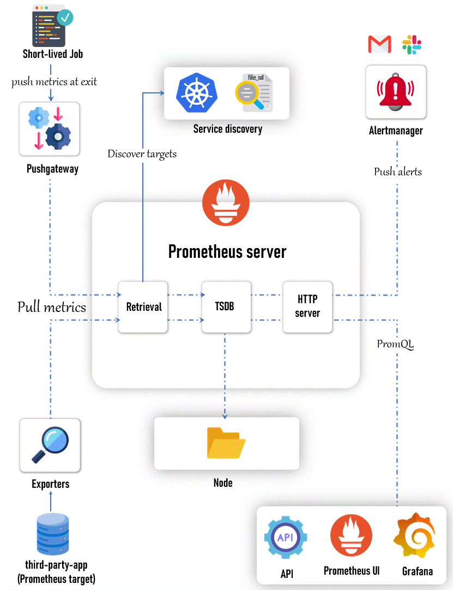

# 📊 Observability: Metrics and Monitoring

---

## 🎯 Learning Objectives

- Understand what metrics are and how they differ from monitoring
- Explore real-life analogies to internalize concepts
- Learn about Prometheus architecture and key components
- Deploy Prometheus, Grafana, and Alertmanager on an EKS cluster using Helm
- Understand exporters, service discovery, and Prometheus' role in observability

---

## 🧠 Metrics vs Monitoring

**📌 Metrics** are raw measurements of a system’s state at a point in time.  
Examples: CPU usage, memory usage, number of HTTP requests, latency.

**📌 Monitoring** is the process of continuously collecting and analyzing these metrics to detect issues, define baselines, and trigger alerts.

### 🏥 Real-Life Analogy:
A **nurse** collects a patient's vitals (metrics) like heartbeat and blood pressure at regular intervals. A **doctor** reviews this data over time to diagnose conditions and decide on treatment (monitoring).

---

## 🚀 Prometheus: Monitoring Toolkit

Prometheus is an open-source monitoring system that collects and stores metrics as time-series data. It’s widely used in the Kubernetes ecosystem.

Key Features:
- Pull-based model (scrapes targets at regular intervals)
- Query language: PromQL
- Built-in time-series database
- Alerting via Alertmanager
- Integrates seamlessly with Grafana for dashboards

---

## 🏗️ Prometheus Architecture



### Core Components:
| Component         | Description |
|------------------|-------------|
| **Prometheus Server** | Core engine that scrapes metrics and stores them in TSDB |
| **TSDB** | Time-series database for storing metrics |
| **HTTP Server** | Exposes Prometheus UI and API |
| **Retrieval Engine** | Scrapes metrics from targets |
| **Service Discovery** | Dynamically finds targets (e.g., via Kubernetes API) |
| **PushGateway** | Enables ephemeral jobs to push metrics |
| **Alertmanager** | Sends notifications via Slack, PagerDuty, etc. |
| **Exporters** | Translate system/app data into Prometheus format (e.g., Node Exporter) |

---

## 🧲 Exporters: Extending Prometheus

Exporters are agents that expose metrics from systems that don't expose native Prometheus metrics.

| Exporter          | Function |
|------------------|----------|
| **Node Exporter** | Provides hardware/OS metrics (CPU, memory, disk) |
| **Kube-State-Metrics** | Pulls pod, deployment, and event data from Kubernetes |
| **Application Metrics (/metrics)** | Developers create these endpoints to expose business metrics |
| **Database Exporters** | MySQL, PostgreSQL exporters to expose DB internals |

Prometheus scrapes data from these exporters and stores it in its TSDB.

---

## 🧪 Real-World Use Case

In production environments (e.g., EKS):
- DevOps installs Prometheus stack via Helm
- Developers expose `/metrics` endpoints in their applications
- Prometheus scrapes those metrics
- Grafana visualizes them
- Alertmanager handles alert routing and notifications

---

## ⚙️ Prometheus Installation on EKS

### 📦 Step 1: Create EKS Cluster:

```bash
eksctl create cluster --name=observability \
                      --region=us-east-1 \
                      --zones=us-east-1a,us-east-1b \
                      --without-nodegroup
```

Associate IAM OIDC Provider:

```bash
eksctl utils associate-iam-oidc-provider \
    --region us-east-1 \
    --cluster observability \
    --approve
```
Create Node Group & add EKS cluster to your kubectl-cli
```bash
eksctl create nodegroup --cluster=observability \
                        --region=us-east-1 \
                        --name=observability-ng-private \
                        --node-type=t3.medium \
                        --nodes-min=2 \
                        --nodes-max=3 \
                        --node-volume-size=20 \
                        --managed \
                        --asg-access \
                        --external-dns-access \
                        --full-ecr-access \
                        --appmesh-access \
                        --alb-ingress-access \
                        --node-private-networking

# Update ./kube/config file
aws eks update-kubeconfig --name observability
```
### 🧰 Step 2: Install kube-prometheus-stack
```bash
helm repo add prometheus-community https://prometheus-community.github.io/helm-charts
helm repo update
```

### 🚀 Step 3: Deploy the chart into a new namespace "monitoring"
```bash
kubectl create ns monitoring
```
```bash
cd day-2

helm install monitoring prometheus-community/kube-prometheus-stack \
-n monitoring \
-f ./custom_kube_prometheus_stack.yml
```

### ✅ Step 4: Verify the Installation
```bash
kubectl get all -n monitoring
```
- **Prometheus UI**:
```bash
kubectl port-forward service/prometheus-operated -n monitoring 9090:9090
```

**NOTE:** If you are using an EC2 Instance or Cloud VM, you need to pass `--address 0.0.0.0` to the above command. Then you can access the UI on <instance-ip:port>

- **Grafana UI**: password is `prom-operator`
```bash
kubectl port-forward service/monitoring-grafana -n monitoring 8080:80
```
- **Alertmanager UI**:
```bash
kubectl port-forward service/alertmanager-operated -n monitoring 9093:9093
```

### 🧼 Step 5: Clean UP
- **Uninstall helm chart**:
```bash
helm uninstall monitoring --namespace monitoring
```
- **Delete namespace**:
```bash
kubectl delete ns monitoring
```
- **Delete Cluster & everything else**:
```bash
eksctl delete cluster --name observability
```

---

## 📊 Visualizing with Grafana

Grafana connects to Prometheus as a data source.

- Default dashboards are pre-loaded via Helm.
- Grafana provides powerful and customizable dashboards for metrics visualization.
- Next steps include:
  - Customizing dashboards
  - Creating new visualizations
  - Writing alerting rules and integrating with Alertmanager

---

## 🔁 Service Discovery in Kubernetes

Prometheus automatically discovers targets via:

- **Kubernetes service labels**  
- **Endpoints** (e.g., `/metrics`)  
- **Application annotations**

This dynamic discovery ensures that Prometheus always has an up-to-date list of targets, making it highly scalable and suitable for modern cloud-native environments.

---

## 🏁 Summary

- **Metrics**: Quantitative insights into system health
- **Monitoring**: Continuous observation for anomalies and alerts
- **Prometheus**: Scrapes, stores, and serves metrics
- **Grafana**: Visualizes metrics through rich dashboards
- **Alertmanager**: Routes alerts based on defined thresholds
- **Exporters**: Extend observability to various systems and components

